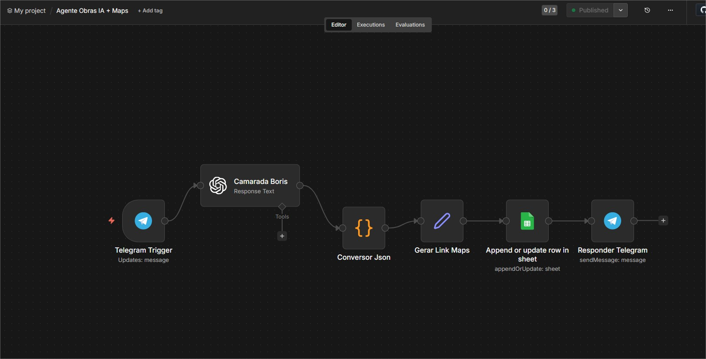
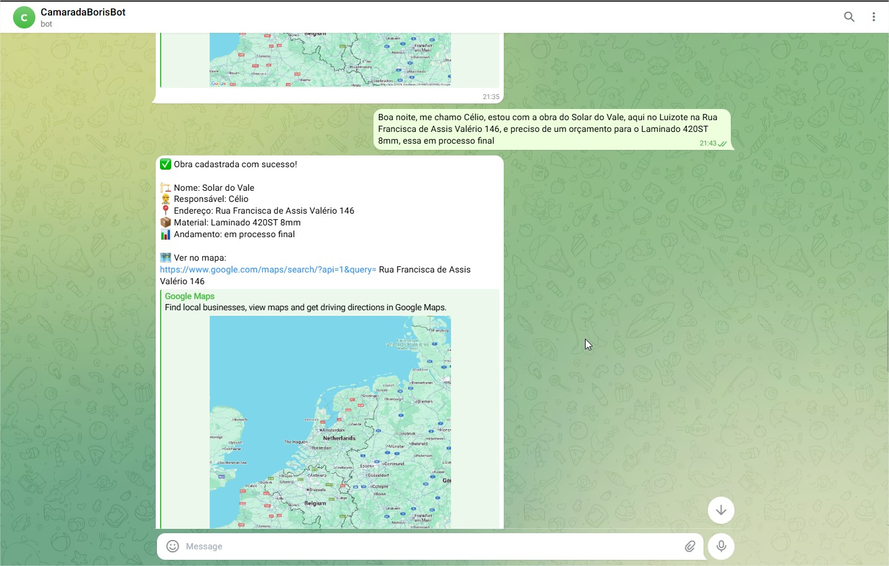
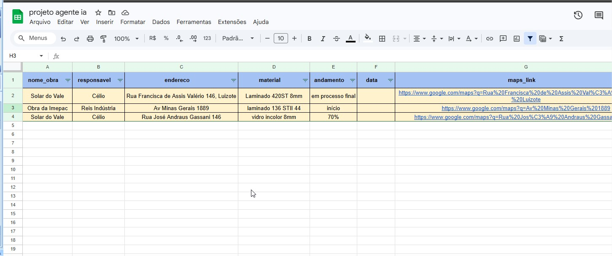
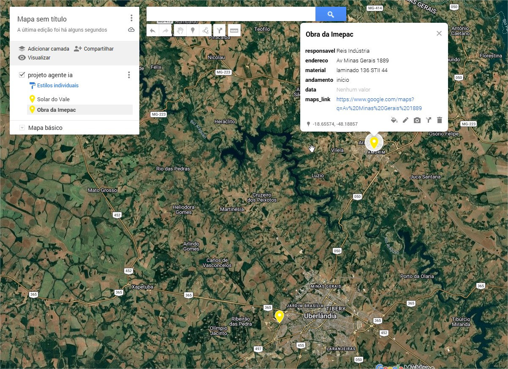

# 🤖 Agente IA para Gestão de Obras

Automação inteligente para coleta, organização e mapeamento de dados de obras.

---
## 💡 Problema

Empresas que trabalham com obras muitas vezes enfrentam dificuldades para organizar informações recebidas via mensagens, como endereço, responsável e status.

Isso gera retrabalho, perda de dados e falta de controle.

---

## 🚀 Solução

Este agente de IA automatiza todo o processo:

- Recebe dados via Telegram
- Interpreta usando Inteligência Artificial
- Organiza automaticamente em uma planilha
- Mapeia as obras no Google Maps

Tudo isso sem intervenção manual.

## 🧠 Arquitetura do Projeto

Telegram → n8n → OpenAI → JSON → Google Sheets → Google Maps

## 🚀 Demonstração

### ⚙️ Fluxo no n8n

### 🤖 Agente Bot 

### 📊 Planilha automática

### 🗺️ Mapeamento no Google Maps

---

## 💡 O que o agente faz

- Recebe dados via Telegram
- Interpreta com Inteligência Artificial
- Estrutura automaticamente os dados
- Salva no Google Sheets
- Gera localização no mapa

---

## 🧠 Tecnologias

- n8n
- OpenAI
- Google Sheets
- Google Maps
- Telegram Bot

---

## 🔄 Fluxo do sistema

1. Usuário envia mensagem  
2. IA extrai os dados  
3. Conversão para JSON  
4. Armazenamento automático  
5. Geração de localização  

---

## 📌 Exemplo real

Entrada:
Obra Anhanguera, José, Rua X 123, vidro 8mm

Saída:
✔ Planilha atualizada  
✔ Localização no mapa  

---

## ⚙️ Como usar

1. Importar o arquivo `workflow_n8n.json` no n8n
2. Configurar credenciais:
   - Telegram Bot
   - OpenAI
   - Google Sheets
3. Criar planilha com colunas:
   - nome_obra
   - responsavel
   - endereco
   - material
   - andamento
4. Executar o fluxo

---

## 🚀 Próximos passos

- Integração com WhatsApp
- Hospedagem em servidor próprio
- Implementação de memória persistente
- Uso em ambiente real (petshop familiar) 

---

## 📈 Possíveis aplicações

- Gestão de obras
- Controle de entregas
- Atendimento automatizado
- Pequenas empresas

## 👨‍💻 Autor

Célio Costa
